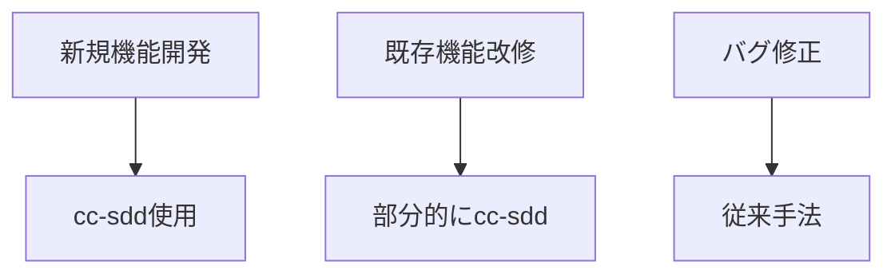

# ベストプラクティス

## 🎯 cc-sdd活用の極意

cc-sddを最大限に活用するためのベストプラクティスと実践的なヒントを紹介します。

## ✨ 成功パターン

### 1. スモールスタート戦略

#### ❌ アンチパターン
```bash
# いきなり大規模機能から開始
/kiro:spec-init "完全なECサイトを構築"
```

#### ✅ ベストプラクティス
```bash
# 小さな機能から段階的に
/kiro:spec-init "商品一覧表示"
/kiro:spec-init "商品詳細ページ"
/kiro:spec-init "カート機能"
# 各機能を個別に完成させてから次へ
```

**理由**: 小さな成功体験を積み重ね、プロジェクトの理解を深めながら進められる

---

### 2. 仕様レビューの徹底

#### 🔍 各フェーズでの確認ポイント

**要件定義フェーズ**
```markdown
チェックリスト:
□ ビジネス要求と一致しているか？
□ 技術的に実現可能か？
□ エッジケースは考慮されているか？
□ 非機能要件は明確か？
```

**設計フェーズ**
```markdown
チェックリスト:
□ 既存アーキテクチャと整合性があるか？
□ スケーラビリティは考慮されているか？
□ セキュリティリスクはないか？
□ パフォーマンスは問題ないか？
```

---

### 3. プロジェクトメモリーの活用

#### 📝 効果的なsteering.mdの更新

```markdown
# steering.md

## プロジェクト概要
[定期的に更新]

## 技術的決定事項
- 2024-01-15: Reactから Next.js 14に移行
- 2024-01-20: 状態管理をZustandに統一

## コーディング規約
- コンポーネント: PascalCase
- カスタムフック: use接頭辞
- ユーティリティ: camelCase

## 今後の方向性
- マイクロサービス化を検討中
- GraphQL APIへの移行計画
```

**更新タイミング**:
- 大きな技術的決定時
- チームメンバー追加時
- 四半期ごとの定期更新

---

### 4. TDDの徹底

#### 🧪 テストファースト開発

```bash
# 実装コマンド実行時の心構え
/kiro:spec-impl

# AIが生成するコード例
// 1. まずテストを書く
test('ユーザーがログインできる', () => {
  // テストコード
})

// 2. 最小限の実装
function login() {
  // 実装
}

// 3. リファクタリング
function login() {
  // 改善された実装
}
```

**メリット**:
- バグの早期発見
- リファクタリングの安全性
- ドキュメントとしてのテスト

---

## 💡 実践テクニック

### 1. 並列開発の活用

```bash
# 独立した機能は並列で開発
ターミナル1: /kiro:spec-init "ユーザープロフィール"
ターミナル2: /kiro:spec-init "通知機能"
ターミナル3: /kiro:spec-init "検索機能"
```

**ポイント**:
- 依存関係のない機能を選ぶ
- 各機能に専任のレビュアーを割り当てる
- マージ時の競合を最小化

---

### 2. 仕様のバージョン管理

```bash
# Gitで仕様書を管理
git add kiro/
git commit -m "feat(auth): ユーザー認証仕様 v1.0"
git tag spec-auth-v1.0

# 仕様変更時
git commit -m "feat(auth): 2FA追加 v1.1"
git tag spec-auth-v1.1
```

**メリット**:
- 仕様の変更履歴を追跡
- 以前の仕様に戻せる
- チーム間での共有が容易

---

### 3. カスタムテンプレートの作成

```bash
# プロジェクト固有のテンプレート
mkdir kiro/templates

# 機能仕様テンプレート
cat > kiro/templates/feature-spec.md << EOF
# 機能名:

## 概要

## ユーザーストーリー

## 技術要件

## セキュリティ考慮事項

## パフォーマンス目標
EOF
```

---

## 🚀 プロダクション導入

### フェーズ1: パイロット導入


**実施内容**:
1. 影響範囲の小さい機能で試行
2. チームでフィードバック収集
3. ワークフロー調整

### フェーズ2: 段階的展開



### フェーズ3: 全面導入

- 全新規開発でcc-sdd使用
- 仕様書をドキュメントの正式版に
- CIパイプラインとの統合

---

## 📊 効果測定

### KPI設定例

| 指標 | 従来 | cc-sdd導入後 | 改善率 |
|-----|------|------------|--------|
| 開発速度 | 2週間/機能 | 3日/機能 | 76% |
| バグ率 | 15件/機能 | 3件/機能 | 80% |
| 仕様変更 | 5回/機能 | 1回/機能 | 80% |
| ドキュメント作成時間 | 8時間 | 0時間（自動） | 100% |

### 測定方法

```bash
# 開発時間の記録
/kiro:spec-init "機能A" # 開始時刻記録
# ...
/kiro:spec-impl # 完了時刻記録

# バグ数のトラッキング
git log --grep="fix:" --oneline | wc -l
```

---

## 🔧 トラブルシューティング

### よくある問題と解決策

#### 問題1: AIが意図しない設計を生成

**解決策**:
```bash
# ステアリングを更新
/kiro:steering

# 設計制約を明示
/kiro:spec-init "機能X（既存のアーキテクチャパターンに従う）"
```

#### 問題2: タスクが大きすぎる

**解決策**:
```bash
# ロールバックして再分解
/kiro:rollback tasks

# より詳細な設計を要求
/kiro:spec-design --detailed
```

#### 問題3: テストが失敗する

**解決策**:
```bash
# TDDサイクルの確認
1. テストを一つずつ実行
2. 失敗箇所を特定
3. 最小限の修正
4. 全テスト再実行
```

---

## 🎓 チーム導入ガイド

### ステップ1: 勉強会の実施

```markdown
アジェンダ（2時間）:
1. cc-sddの概要説明（30分）
2. デモンストレーション（30分）
3. ハンズオン（45分）
4. Q&A（15分）
```

### ステップ2: ペアプログラミング

- 経験者と初心者のペアリング
- 実際の機能開発を通じた学習
- ナレッジ共有セッション

### ステップ3: 社内ガイドライン作成

```markdown
# 社内cc-sddガイドライン

## 使用対象
- 新規機能開発: 必須
- 大規模改修: 推奨
- バグ修正: 任意

## 承認フロー
- 要件: プロダクトオーナー承認
- 設計: テックリード承認
- 実装: ピアレビュー

## 品質基準
- テストカバレッジ: 80%以上
- パフォーマンス: 既定値以内
```

---

## 🌟 上級テクニック

### AIプロンプトの最適化

```bash
# 具体的な制約を含める
/kiro:spec-init "認証機能（JWT使用、Redis セッション、Rate Limiting付き）"

# 参考実装を示す
/kiro:spec-design --reference="auth-service-v2"

# パフォーマンス要件を明示
/kiro:spec-requirements --performance="応答時間100ms以内"
```

### カスタムコマンドの作成

```bash
# プロジェクト固有のエイリアス
alias spec-feature='/kiro:spec-init && /kiro:spec-requirements && /kiro:spec-design'

# 使用例
spec-feature "新機能"
```

---

## 📚 継続的改善

### 振り返りの実施

**週次レトロスペクティブ**:
- cc-sddで開発した機能のレビュー
- プロセスの改善点識別
- ベストプラクティスの共有

### ドキュメントの更新

```bash
# 学んだことを記録
echo "## 2024-01-20の学び" >> kiro/lessons-learned.md
echo "- 設計フェーズで○○を考慮すべき" >> kiro/lessons-learned.md
```

---

## 🚀 まとめ

cc-sddを成功させるための黄金律：

1. **小さく始める** - 最初は簡単な機能から
2. **レビューを徹底** - 各フェーズで人間の確認
3. **ドキュメント化** - 学びを記録し共有
4. **継続的改善** - プロセスを常に見直す
5. **チームで取り組む** - 知識を共有し成長

---

*これらのベストプラクティスを参考に、あなたのプロジェクトでcc-sddを成功させましょう！*