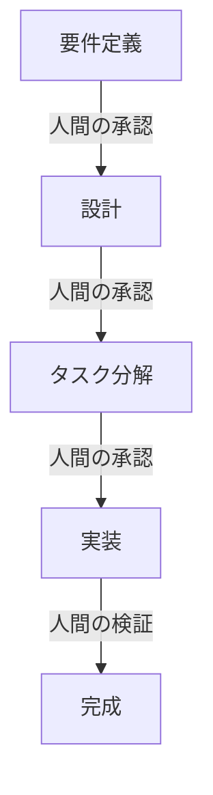

# cc-sdd（仕様駆動開発）とは

## 🚀 概要

**cc-sdd** (Claude Code Spec-Driven Development) は、日本の開発者によって作られた、AIと協調して仕様駆動開発（SDD: Specification-Driven Development）を実現するツールです。

従来の「コードファースト」の開発から、「仕様ファースト」の開発へのパラダイムシフトを実現し、**AIが実行し、人間が検証する**という新しい開発スタイルを提供します。

## 🌟 なぜcc-sddが必要なのか？

### 従来のVibe Codingの課題

Vibe Codingでは自由にAIと対話しながら開発できますが、以下の課題があります：

- 🔸 **曖昧な要件** - 明確な仕様なしに開発が進む
- 🔸 **一貫性の欠如** - セッションが変わると文脈が失われる
- 🔸 **品質の不安定性** - AIの独断で進むリスク
- 🔸 **ドキュメント不足** - 後から何を作ったか分からなくなる

### cc-sddが解決すること

cc-sddは、これらの課題を「**仕様駆動開発**」で解決します：

- ✅ **明確な仕様** - 開発前に要件を文書化
- ✅ **一貫性の維持** - プロジェクトメモリーで文脈を保持
- ✅ **品質の保証** - 各フェーズで人間の承認が必須
- ✅ **完全なドキュメント** - 仕様が自動的にドキュメントになる

## 📊 開発効率の革命

### 従来の開発
```
計画（2週間）→ 実装（1週間）→ テスト（1週間）
= 4週間のスプリント
```

### cc-sddによる開発
```
仕様（30分）→ 設計（30分）→ 実装（2時間）
= 3時間のBoltサイクル
```

**約70%の管理オーバーヘッドを削減**し、数週間かかっていた開発を数時間で完了できます。

## 🎯 主な特徴

### 1. AWS Kiro互換
AWS Kiroの仕様駆動開発スタイルと完全互換。エンタープライズレベルの品質基準に対応。

### 2. マルチツール対応
- **Claude Code** - Anthropicの最新AI
- **Cursor IDE** - VSCodeベースの統合開発環境
- **Gemini CLI** - Googleの強力なAI
- **Qwen Code** - 中国発の高性能AI

### 3. 日本語ネイティブサポート
日本の開発者が日本の開発現場のために作った、完全日本語対応ツール。

### 4. プロジェクトメモリー
セッションを跨いでプロジェクトの文脈、設計決定、開発パターンを記憶。

## 🔄 開発ワークフロー



各フェーズで人間の承認が必要なため、AIが独断で進むことを防ぎ、意図通りの開発が保証されます。

## 💡 cc-sddが適している場面

### ✨ 最適な用途
- 🏢 **エンタープライズ開発** - 仕様書が必須の案件
- 📱 **新規プロダクト開発** - 明確な要件定義が重要
- 🔧 **リファクタリング** - 既存コードの改善
- 🎯 **機能追加** - 既存プロジェクトへの追加開発

### ⚠️ 向いていない用途
- 🎨 **クリエイティブな実験** - 自由な発想が重要な場合
- 🚀 **プロトタイピング** - 速度重視の検証
- 🎮 **趣味プロジェクト** - 楽しさ重視の開発

## 🌈 Vibe Codingとcc-sddの使い分け

| 項目 | Vibe Coding | cc-sdd |
|------|------------|--------|
| アプローチ | 対話的・探索的 | 仕様駆動・計画的 |
| 適した場面 | アイデア検証、学習 | 本番開発、チーム開発 |
| 品質保証 | AIに依存 | 人間が検証 |
| ドキュメント | 後付け | 自動生成 |
| 学習曲線 | 緩やか | やや急 |

## 🚀 次のステップ

cc-sddを使い始める準備はできましたか？

- 📖 [はじめ方ガイド](/docs/cc-sdd/getting-started) - インストールと初期設定
- 🔄 [ワークフローの詳細](/docs/cc-sdd/workflow) - 開発プロセスを理解する
- 📝 [コマンドリファレンス](/docs/cc-sdd/commands) - 利用可能なコマンド一覧

---

*cc-sddは、AIと人間が協調して高品質なソフトウェアを効率的に開発するための、次世代の開発ツールです。*