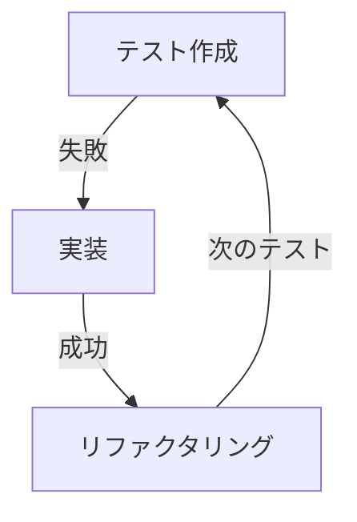

# ワークフローの詳細

## 🔄 cc-sddの開発フロー

cc-sddは、**仕様駆動開発（SDD）** の原則に基づいた6つのフェーズで構成されています。各フェーズで人間の承認が必要なため、品質が保証されます。


## 📊 フェーズ詳細

### フェーズ0: ステアリング（プロジェクト理解）

#### 目的
既存プロジェクトの構造、技術スタック、コーディング規約を理解し、AIに文脈を与える。

#### コマンド
```bash
/kiro:steering
```

#### 実行内容
- 📁 **ファイル構造分析**: プロジェクトのディレクトリ構成を把握
- 🔧 **技術スタック検出**: 使用言語、フレームワーク、ライブラリを特定
- 📝 **コーディング規約認識**: 既存コードのスタイルを学習
- 🎨 **アーキテクチャ理解**: システム設計パターンを把握

#### 生成物
```
steering.md
├── プロジェクト概要
├── 技術スタック
├── ディレクトリ構造
├── コーディング規約
└── アーキテクチャパターン
```

---

### フェーズ1: 仕様初期化

#### 目的
開発する機能の初期仕様を作成。最初は曖昧でも構わない。

#### コマンド
```bash
/kiro:spec-init "機能の概要説明"
```

#### 例
```bash
/kiro:spec-init "ユーザーがログインできるようにする"
```

#### 実行内容
- 🎯 **機能の概要定義**: 何を作るかを明確化
- 📊 **初期スコープ設定**: 大まかな範囲を決定
- 🔍 **既存機能との関連性分析**: 影響範囲を確認

#### 生成物
```
kiro/features/[feature-name]/spec.md
├── 機能概要
├── 初期スコープ
└── 関連機能
```

---

### フェーズ2: 要件定義

#### 目的
曖昧な仕様を詳細で明確な要件に変換。

#### コマンド
```bash
/kiro:spec-requirements
```

#### 実行内容
- ✅ **機能要件の詳細化**
  - ユーザーストーリー
  - 受け入れ条件
  - エッジケース

- 🔒 **非機能要件の定義**
  - パフォーマンス要件
  - セキュリティ要件
  - 可用性要件

- 🚫 **制約事項の明確化**
  - 技術的制約
  - ビジネス制約
  - リソース制約

#### 生成物
```
kiro/features/[feature-name]/requirements.md
├── ユーザーストーリー
├── 機能要件
│   ├── 必須要件
│   └── オプション要件
├── 非機能要件
├── 受け入れ条件
└── 制約事項
```

#### 承認ポイント ✋
- 要件に漏れがないか？
- 実現可能な範囲か？
- ビジネス要求と一致しているか？

---

### フェーズ3: 設計

#### 目的
要件を満たす技術的な設計を作成。

#### コマンド
```bash
/kiro:spec-design
```

#### 実行内容
- 🏗️ **アーキテクチャ設計**
  - システム構成図
  - コンポーネント設計
  - データフロー

- 💾 **データ設計**
  - データモデル
  - データベーススキーマ
  - 状態管理

- 🔌 **インターフェース設計**
  - API仕様
  - UI/UXデザイン
  - 外部連携

#### 生成物
```
kiro/features/[feature-name]/design.md
├── システムアーキテクチャ
├── コンポーネント図
├── シーケンス図
├── データモデル
├── API仕様
└── 実装方針
```

#### 承認ポイント ✋
- 既存アーキテクチャと整合性があるか？
- スケーラビリティは考慮されているか？
- 保守性は確保されているか？

---

### フェーズ4: タスク分解

#### 目的
設計を実装可能な小さなタスクに分解。

#### コマンド
```bash
/kiro:spec-tasks
```

#### 実行内容
- 📋 **タスクリスト作成**
  - 実装順序の決定
  - 依存関係の整理
  - 工数見積もり

- 🎯 **マイルストーン設定**
  - 段階的なリリース計画
  - テスト計画
  - レビューポイント

#### 生成物
```
kiro/features/[feature-name]/tasks.md
├── タスクリスト
│   ├── [ ] データベース設計
│   ├── [ ] APIエンドポイント実装
│   ├── [ ] フロントエンド実装
│   └── [ ] テスト作成
├── 依存関係
└── 見積もり工数
```

#### 承認ポイント ✋
- タスクの粒度は適切か？
- 実装順序は論理的か？
- 見積もりは現実的か？

---

### フェーズ5: 実装

#### 目的
TDD（テスト駆動開発）で品質を保証しながら実装。

#### コマンド
```bash
/kiro:spec-impl
```

#### 実行内容
- 🧪 **テストファースト**
  1. テストケース作成
  2. テスト失敗確認（レッド）
  3. 最小限の実装（グリーン）
  4. リファクタリング（リファクタ）

- 📝 **コード生成**
  - タスクに基づく実装
  - コーディング規約準拠
  - ドキュメント生成

#### TDDサイクル


#### 生成物
```
src/
├── components/     # 実装コード
├── tests/         # テストコード
└── docs/          # 自動生成ドキュメント
```

---

## 🔄 ワークフロー実行例

### 実例: ユーザー認証機能の実装

```bash
# 1. プロジェクト理解
/kiro:steering
# → プロジェクト構造を分析...

# 2. 機能初期化
/kiro:spec-init "ユーザー認証機能（ログイン、ログアウト、セッション管理）"
# → 初期仕様を作成...

# 3. 要件定義
/kiro:spec-requirements
# → 詳細要件を生成...
# ✋ 人間が確認・承認

# 4. 設計
/kiro:spec-design
# → システム設計を作成...
# ✋ 人間が確認・承認

# 5. タスク分解
/kiro:spec-tasks
# → 実装タスクリストを生成...
# ✋ 人間が確認・承認

# 6. 実装
/kiro:spec-impl
# → TDDで実装開始...
```

## 📈 進捗管理

### 仕様書の確認

```bash
# 現在の仕様を確認
cat kiro/features/auth/spec.md

# 要件を確認
cat kiro/features/auth/requirements.md

# タスク進捗を確認
cat kiro/features/auth/tasks.md
```

### バージョン管理

```bash
# 仕様書をGitで管理
git add kiro/
git commit -m "feat: ユーザー認証機能の仕様追加"
```

## ⚡ 高速イテレーション

### Boltサイクル

従来の2週間スプリントではなく、**数時間で完結するBoltサイクル**を実現：

```
仕様（30分）→ 設計（30分）→ タスク（15分）→ 実装（2時間）
= 約3時間で機能完成
```

### 並列開発

複数の機能を並行して開発可能：

```bash
# 機能A
/kiro:spec-init "検索機能"

# 別ターミナルで機能B
/kiro:spec-init "通知機能"
```

## 🎯 成功のポイント

### ✅ Do's
- 各フェーズで必ず人間が確認
- 小さな機能から始める
- 仕様書をバージョン管理
- TDDを徹底する

### ❌ Don'ts
- AIの出力を無批判に承認
- 大きすぎる機能を一度に開発
- 仕様書を更新しない
- テストをスキップ

## 📚 次のステップ

- 📝 [コマンドリファレンス](/docs/cc-sdd/commands) - 全コマンドの詳細
- 🎯 [ベストプラクティス](/docs/cc-sdd/best-practices) - 効率的な活用方法

---

*cc-sddのワークフローを理解したら、実際のプロジェクトで試してみましょう！*